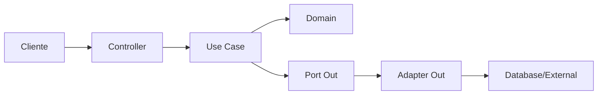

# 💰 Sistema de Gerenciamento Financeiro

## 📋 Visão Geral

O **Sistema de Gerenciamento Financeiro** é uma aplicação web desenvolvida para auxiliar usuários no controle de suas finanças pessoais. O sistema permite o cadastro e categorização de transações financeiras, geração de relatórios e gráficos, além de notificações automáticas para vencimentos.

### 🎯 Propósito

- **Controle Financeiro Pessoal**: Registro e acompanhamento de receitas e despesas
- **Categorização Inteligente**: Organização das transações por categorias personalizáveis
- **Análise Visual**: Dashboards e gráficos para análise de padrões financeiros
- **Gestão de Vencimentos**: Sistema de notificações para contas a pagar

### 🔗 Links Importantes

- **Backend API**: [gerenciador-financas](https://github.com/ViniciusKoiti/gerenciador-financas)
- **Frontend Web**: [gerenciador-financas-app](https://github.com/ViniciusKoiti/gerenciador-financas-app) *(em desenvolvimento)*
- **Documentação API**: `/swagger-ui.html` *(quando aplicação estiver rodando)*

---

## 🚀 Quick Start

### Pré-requisitos
- Java 21+
- Docker & Docker Compose
- Maven 3.8+

### Instalação e Execução

```bash
# Clone o repositório
git clone https://github.com/ViniciusKoiti/gerenciador-financas.git
cd gerenciador-financas

# Suba os serviços necessários (RabbitMQ)
docker-compose up -d

# Execute a aplicação
./mvnw spring-boot:run

# Acesse a documentação da API
http://localhost:8080/swagger-ui.html
```

### Primeiros Passos

1. **Crie um usuário** via endpoint `/api/auth/register`
2. **Faça login** em `/api/auth/login` para obter o token JWT
3. **Use o token** no header `Authorization: Bearer {token}`
4. **Explore a API** através do Swagger UI

---

## 🛠️ Stack Tecnológica

### Backend Core
- **Java 21** - Linguagem principal
- **Spring Boot 3.3.4** - Framework base
- **Spring Security** - Autenticação e autorização JWT
- **Spring Data JPA** - Persistência de dados
- **H2 Database** - Banco em memória *(desenvolvimento)*
- **MapStruct** - Mapeamento entre DTOs
- **RabbitMQ** - Mensageria assíncrona

### Arquitetura & Padrões
- **Hexagonal Architecture** - Ports & Adapters
- **Domain-Driven Design** - Modelagem rica do domínio
- **Clean Architecture** - Independência de frameworks

### DevOps & Qualidade
- **Docker & Docker Compose** - Containerização
- **GitHub Actions** - CI/CD pipeline
- **JUnit 5 & Mockito** - Testes unitários
- **TestContainers** - Testes de integração
- **Swagger/OpenAPI** - Documentação automática

---

## 📊 Status do Projeto

### Progresso Geral

| Área | Status | Progresso |
|------|--------|-----------|
| **Funcionalidades Core** | ✅ Concluído | 95% |
| **Arquitetura Limpa** | 🟡 Em evolução | 75% |
| **Cobertura de Testes** | ✅ Bom | 80% |
| **Documentação** | ✅ Bom | 85% |
| **Segurança** | ✅ Implementado | 90% |
| **Performance** | 🟡 A otimizar | 60% |
| **Production Ready** | 🟡 Em progresso | 70% |

### ✅ Funcionalidades Implementadas

#### 🔐 **Autenticação e Segurança**
- ✓ Registro com validação de email único
- ✓ Login JWT com tokens seguros
- ✓ Autorização baseada em propriedade
- ✓ Criptografia BCrypt

#### 💳 **Gestão Financeira**
- ✓ CRUD completo de transações
- ✓ Categorização customizada
- ✓ Filtros e busca paginada
- ✓ Cálculo automático de saldos

#### 📈 **Analytics e Relatórios**
- ✓ Gráficos por categoria
- ✓ Evolução temporal de finanças
- ✓ Resumo financeiro consolidado
- ✓ Exportação de dados *(básica)*

#### 🔔 **Notificações**
- ✓ Sistema de notificações via RabbitMQ
- ✓ Processamento assíncrono
- ✓ Alertas de vencimento

### 🚧 Funcionalidades em Desenvolvimento

#### **Frontend Web** *(Sprint Atual)*
- 🔄 Interface Angular moderna
- 🔄 Dashboard interativo
- 🔄 Gráficos com Chart.js
- 🔄 PWA capabilities

#### **Melhorias Arquiteturais** *(Próxima Sprint)*
- ⏳ Separação pura de domínio
- ⏳ Modularização Maven
- ⏳ Event Sourcing
- ⏳ CQRS pattern

---

## 🗺️ Roadmap

### Q1 2025 - Fundação
- [x] MVP Backend funcional
- [x] Autenticação e autorização
- [x] API RESTful documentada
- [ ] Frontend web completo
- [ ] Deploy em produção

### Q2 2025 - Crescimento
- [ ] App mobile (Flutter)
- [ ] Integração Open Banking
- [ ] Import/Export avançado
- [ ] Machine Learning para categorização

### Q3 2025 - Maturidade
- [ ] Multi-tenancy
- [ ] API pública
- [ ] Marketplace de integrações
- [ ] Versão Enterprise

---

## 🏗️ Arquitetura

### Estrutura de Pacotes

```
src/main/java/com/vinicius/gerenciamento_financeiro/
├── adapter/           # Adapters (entrada/saída)
│   ├── in/           # Controllers, DTOs
│   └── out/          # Repositories, clients
├── application/      # Casos de uso
│   └── service/      # Implementações
├── domain/           # Entidades e regras
│   ├── model/        # Aggregates, VOs
│   └── exception/    # Exceções de domínio
└── port/             # Interfaces (portas)
    ├── in/           # Use cases
    └── out/          # Gateways
```

### Fluxo de Dados



---

## 🧪 Testes

### Executar Testes

```bash
# Todos os testes
./mvnw test

# Apenas unitários
./mvnw test -Dtest="*Test"

# Apenas integração
./mvnw test -Dtest="*IT"

# Com cobertura
./mvnw clean test jacoco:report
```

### Estratégia de Testes

- **Unitários**: Lógica de negócio isolada
- **Integração**: Fluxos completos com TestContainers
- **Contrato**: Validação de APIs
- **Carga**: Performance com Gatling *(planejado)*

---

## 🔧 Configuração

### Variáveis de Ambiente

```properties
# Banco de Dados
DB_URL=jdbc:h2:mem:testdb
DB_USER=sa
DB_PASSWORD=

# JWT
JWT_SECRET=your-secret-key
JWT_EXPIRATION=86400000

# RabbitMQ
RABBITMQ_HOST=localhost
RABBITMQ_PORT=5672
RABBITMQ_USER=guest
RABBITMQ_PASSWORD=guest

# Aplicação
SERVER_PORT=8080
SPRING_PROFILES_ACTIVE=dev
```

### Profiles Disponíveis

- **dev**: Desenvolvimento local com H2
- **test**: Testes automatizados
- **prod**: Produção com PostgreSQL *(em implementação)*

---

## 📝 Convenções e Padrões

### Commits
Seguimos [Conventional Commits](https://www.conventionalcommits.org/):
- `feat:` Nova funcionalidade
- `fix:` Correção de bug
- `docs:` Documentação
- `refactor:` Refatoração
- `test:` Testes
- `chore:` Tarefas gerais

### Branches
- `main` - Produção estável
- `develop` - Desenvolvimento integrado
- `feature/*` - Novas funcionalidades
- `hotfix/*` - Correções urgentes

### Code Review
- PRs obrigatórios para main
- Mínimo 1 aprovação
- Testes passando
- SonarQube aprovado *(futuro)*

---

## 🤝 Como Contribuir

1. **Fork** o projeto
2. **Clone** seu fork: `git clone https://github.com/seu-usuario/gerenciador-financas.git`
3. **Branch** nova feature: `git checkout -b feature/minha-feature`
4. **Commit** suas mudanças: `git commit -m 'feat: adiciona minha feature'`
5. **Push** para o branch: `git push origin feature/minha-feature`
6. **Pull Request** com descrição detalhada

### Guidelines
- Mantenha a cobertura de testes acima de 80%
- Siga os padrões de código existentes
- Documente mudanças significativas
- Atualize o README quando necessário

---

## 📞 Suporte e Contato

### Desenvolvedor
- **Nome**: Vinicius Koiti Nakahara
- **Email**: viniciusnakahara@gmail.com
- **GitHub**: [@ViniciusKoiti](https://github.com/ViniciusKoiti)
- **LinkedIn**: [Adicione seu LinkedIn]

### Comunidade
- **Issues**: [GitHub Issues](https://github.com/ViniciusKoiti/gerenciador-financas/issues)
- **Discussions**: [GitHub Discussions](https://github.com/ViniciusKoiti/gerenciador-financas/discussions)

---

## 📄 Licença

Este projeto está sob a licença MIT. Veja o arquivo [LICENSE](LICENSE) para mais detalhes.

---

<div align="center">
  <p>Feito com ❤️ por Vinicius Koiti</p>
  <p>
    <a href="https://github.com/ViniciusKoiti/gerenciador-financas">⭐ Star no GitHub</a> •
    <a href="https://github.com/ViniciusKoiti/gerenciador-financas/issues">🐛 Reportar Bug</a> •
    <a href="https://github.com/ViniciusKoiti/gerenciador-financas/issues">✨ Solicitar Feature</a>
  </p>
</div>